# Love Gambling

**Love Gambling** is a casino war-style game where users face off against the computer/dealer. Players can add funds, choose their stake, add multiple players, and cash out when they're done. At the end of the game, you'll see your initial investment compared to your final total to assess your performance. The game features a simple, responsive design that works seamlessly without media queries. The odds can be adjusted in the code to favor the computer slightly. I also kept the global variables to a minimum, using only "const" for button variables globally. Although this approach introduced some repetition, it helped keep the code relatively tidy and organized.

**The deployed website can be found here:** [Love Gambling](https://andyv773.github.io/random-game/)

**Responsive Design:**

## User Story

A curious customer, intrigued by the allure of the game, decides to gamble a small amount of money. Luck is on his side, and he wins, encouraging him to keep playing. The thrill of victory drives him to place more bets. However, soon the tide turns, and he begins to lose. Determined to win back his losses, he continues to gamble, pouring more money into the game. Before he realizes it, his funds are depleted, and he’s in debt. The moral of the story.. the computer always wins in the end.

**New User**
- I want to know what the site is for.
- I want to easily learn how to play the game so that I can quickly start playing.
- I want to be able to play with minimal effort and clearly understand how to do so.
- I want it to be clear if I win or lose.

**Returning User**
- I want to come back and play.

**Other Customer Scenarios**

**Site Adminstrator**
- As a site administrator, the game should run smoothly and remain secure.
- As a site administrator, must ensure that the game remains fair and engaging.

## Features
- **Multiplater:**
  - You can choose to play 1 to 3 players. More players can be added by adjusting the code, if needed.
 
- **One Player:**

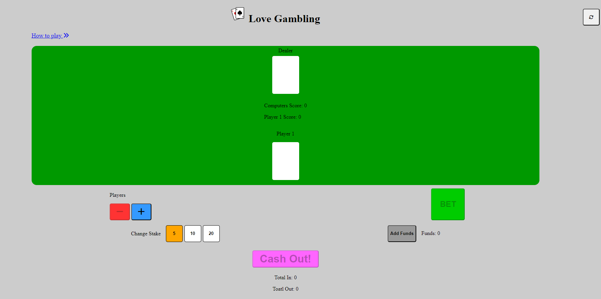

- **Two Player:**

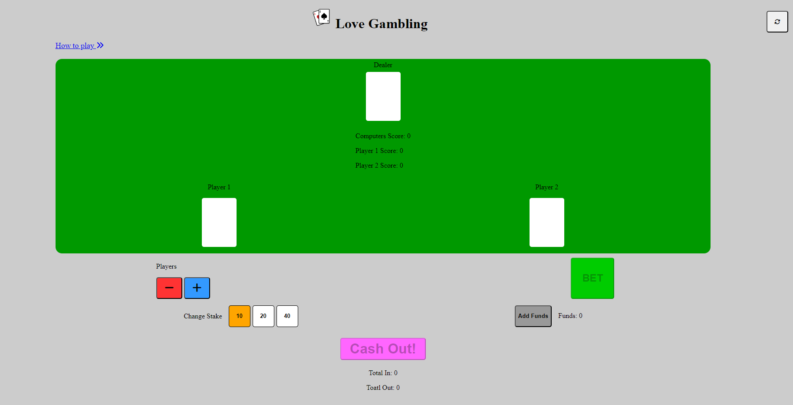

- **Three Player:**

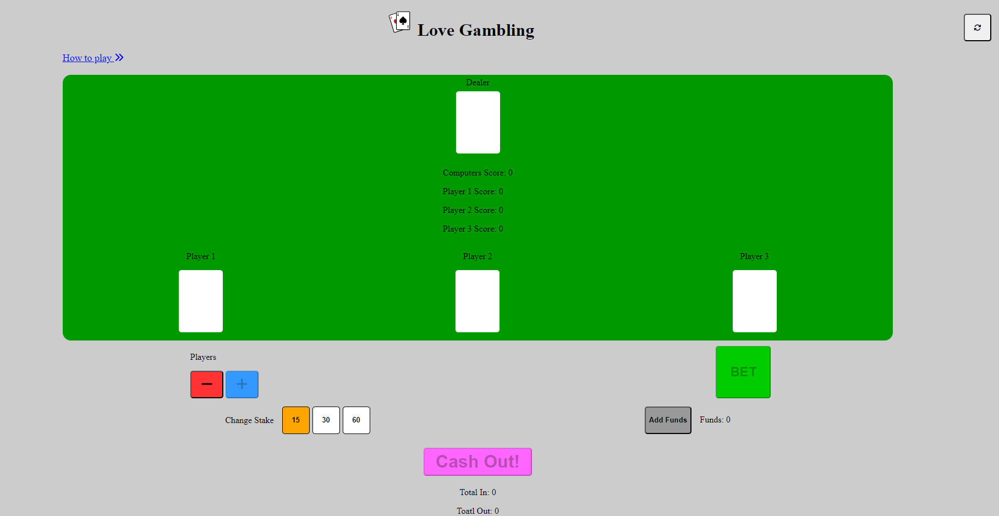

- **Fits nicely on Mobiles:**

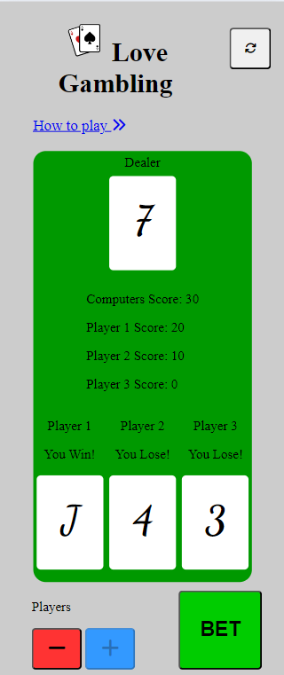

### Game Play

- **Adding Funds:**
  - The user begins by clicking the "Add Funds" button, which increases the available funds in increments of 100, up to a maximum of 1000.

  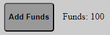
  - The total amount of funds added will be added to "Total In".

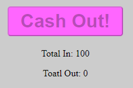 

- **Player and Stake Selection:**
  - The user can choose to have 1, 2, or 3 players participating in the game, using the + or - player buttons.

  
  - After selecting the number of players, the user can choose their stake amount, with a minimum of 5 per player and a maximum of 20 per player. The orange background indicates active stake amount.

  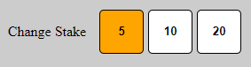
  - The total stake amount will automatically adjust based on the number of players.

  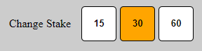

- **Placing a Bet:**
  - Once the stake is set, the user can click the "Bet" button to start the game.

  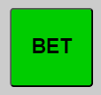
  - A short animation will play, after which the cards for all players and the dealer will be displayed on the board, showing the results for each player.
  - If a player wins, their score will increase, and they will receive double their stake amount. If not, the dealer's score will increase.

  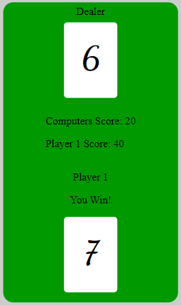

- **Cashing Out:**
  - After the game, the user can click the "Cash Out" button to remove all players' scores and any remaining funds, adding them to the "Total Out".

  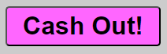
  - The user can then compare the "Total In" with the "Total Out" to see the final result of their gameplay.

  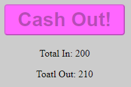

- **User Experience and Security Features:**
  - Certain buttons are disabled during gameplay to enhance the user experience and implement basic security features.
  - A "Reset" button is available in the top left corner, allowing the user to reset all scores and funds.
  
  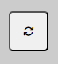

## Scope

My aim is to create a simple random card-style game where the user is up against the computer. The user will need to click "Add Funds" to add an amount to the fund section, which will work in increments of 5. The user can choose a stake in amounts of 5, 10, and 20. When the user clicks "Draw," a card number will appear on the board for both the player and the computer.

The result is simple: the highest card ranking will win, with 2 being the lowest and A (Ace) being the highest. The computer will calculate the winner and add the funds to either the player's score or the computer's score. It is a game of complete chance based on a random number generator.

The user will also be able to add up to a maximum of 3 players. Each player is up against the computer, and their scores will be listed separately on the board. When the player decides to cash out, the total score will be added to the funds.  
  
## WireFrame
**Mobile:** 

**Desktop:**

- Desktop with 3 players

## Manual Testing

I have rigorously tested all buttons and functionality to ensure everything works as expected. This includes verifying that scores are calculated correctly, the correct player wins each round, and all buttons function properly.

## Validator Testing
### HTML
- The website's HTML has passed the offical HTML Validator, ensuring that there are no issues and complys with web standards.
  - [W3C HTML validator](https://validator.w3.org/nu/?doc=https%3A%2F%2Fandyv773.github.io%2Frandom-game%2F)

### CSS
- The website's CSS has passed the offical CSS Validator, ensuring that there are no issues and complys with web standards.
  - [W3C CSS validator](https://jigsaw.w3.org/css-validator/validator?uri=https%3A%2F%2Fandyv773.github.io%2Frandom-game%2F&profile=css3svg&usermedium=all&warning=1&vextwarning=&lang=en)

### Lighthouse Testing
**Desktop:**

**Mobile:**
- Slightly lower performance on mobile

## Debugging
- **Preventing Excessive Fund Additions:**
I encountered an issue where the add funds button could be clicked multiple times, causing the funds to exceed the maximum limit. To fix this, I disabled the add funds button once the selected amount was reached, preventing any further increases beyond the intended limit.

- **Preventing Multiple Bets:**
I also had an issue where the bet button could be clicked multiple times during the animation on the round, causing the game to use all the funds and even result in negative funds. To fix this, I disabled the bet button while the animation function was running. After the game calculated the scores, I reactivated the bet button only if the funds were sufficient.

- **Lighthouse Score Improvements:**
  - Originally, my accessibility score was lower due to missing "aria-labels" on buttons without text content. I improved this by adding the corresponding aria-labels, ensuring better screen reader support.
  - I added meta keywords and a description to increase SEO score

## Future Features

With more time, I would like to add the following features to the game:

1. **Draw Scenario:**
In the event of a draw, I intend to introduce a feature where players can choose to either:
- **Surrender:** The player loses the round, forfeiting their stake.
- **Go to War:** The player must double their stake and play an additional round to determine the winner. 

2. **Full set of Cards with Images:**
I would like to implement a full deck of cards with visual representations for each card. This will enhance the user experience by making the game more visually appealing.

This will make the game more fun and engaging.

## Deployment

The site has been deployed to GitHub pages on GitHub.

- The steps to deploy are as follows:
  - In the [GitHub Repository](https://github.com/AndyV773/random-game), navigate to the Settings tab
  - In settings select pages in the left hand menu, select source deploy from branch
  - Branch should be main and select from root, then click "Save"
  - Once this has been selected and saved, the site should refresh. At the top of
  - GitHub pages section, there will be a link to the site indicating the successful deployment.

The deployed website can be found here: [Love Gambling](https://andyv773.github.io/random-game/)

## Credits
### Content

- Baed on the original game [Casino War](https://en.wikipedia.org/wiki/Casino_War)
- I used the [Love Maths](https://github.com/Code-Institute-Solutions/readme-love-maths) from Code Institue as a refernce
- The icons used were taken from [Font Awesome](https://fontawesome.com/)
- To help with the JavaScript and choose colours, I used [W3S](https://www.w3schools.com/)
- I used [Mozilla](https://developer.mozilla.org/en-US/) for the animation time intervals
- I also use [Stake Over Flow](https://stackoverflow.com/) to help with some code

### Media

- The Favicon icon was generated using [Ionos](https://www.ionos.co.uk/tools/favicon-generator)
- The Logo images was take from [Adobe](https://stock.adobe.com/search/images?k=playing+card+logo&asset_id=96484510)